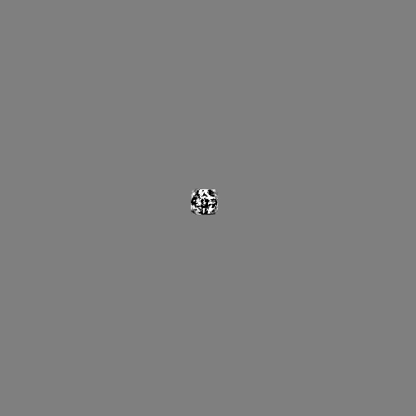

# CPU prototype of eWave and Surface Wavelet algorithm (In Progress)

<b> Purpose </b>: To compare a slightly older but modified algorithm with latest Siggraph paper(2018) solution to wave interaction. The goal is to do an analytical analysis of these two methods to come up with a faster and more accurate wave simulation as compared to what's currently been using in game production.  

## Requirements 

   You would need
 - [STB image library] (https://github.com/nothings/stb)
 - glm clamp function (TO DO: Need to write a custom clamp),
 - c++14 and above compiler . 
 - [glut] (https://www.opengl.org/resources/libraries/glut/)
 - [fftw] (http://www.fftw.org/)
 - openMP 3.0
 
## 1) eWave Algorithm

  <b>Motivation</b>: To implement and develop a faster and more accurate method for player water wave interaction which can be utilized in production in game companies.

  <b>Problem</b>: Current game methodologies utilize shallow water equations to simulate player water wave interaction. The issue with this approach is that shallow water equations do not take into consideration <b>dispersion</b> in the wave equation. Traditional shallow water equations are also resolution bound hence simulation quality is dependent on the resolution of the grid.

  <b>Note: What is dispersion?</b>

       Dispersion in layman terms refers to waves of different frequencies traveling at the different speeds. Shallow water equations do not account for dispersion so waves of all frequencies travel at the same speed. In the image below we see various frequencies of ocean waves dispersing out at different speeds.

  <b>Goals </b>:-
 - Create a CPU prototype of the [eWave algorithm] (https://people.cs.clemson.edu/~jtessen/reports/papers_files/ewavealgorithm.pdf) (Completed)
 - Enhance the algorithm by adding advection of the wave, wave generation on moving objects and bouyancy generation. (Completed)
 - Create a CPU prototype of the [Surface Wavelet algorithm] ( https://dl.acm.org/citation.cfm?id=3201336) (Completed)
 - Generate a GPU prototype of the enhanced eWave algorithm in the Unreal Engine 4 (In progress)
 - Generate a GPU prototype of the Surface Wavelet algorithm in the Unreal Engine 4 
 - Compare the fps and simulation times.

  I will be using as much code provided by the Surface Wavelet algorithm to compare with my enhanced eWave algorithm to stay true to the original author's vision. I will not be comparing channel flow or other methods utilized by the Surface wavelets.

  <b> MileStone </b>:
  - End Date: May 10th, 2019.
 
 <b>Existing Solutions </b>:
 There are several solutions to the problem of having more accurate wave interaction which leads but each have their drawbacks.
 - iWave and eWave : Dr. Tessendorf proposed a Convolution filter based approach of solving the iWave and eWave equations derived from combining Bernoli's Equation and Energy Conservation [Click here for author's slides](https://people.cs.clemson.edu/~jtessen/reports/papers_files/course_slides2002.pdf). The problem arises in the resolution of the kernal   You can read about it [here](https://people.cs.clemson.edu/~jtessen/reports/papers_files/SimInterSurfWaves.pdf "iWave") and [here](https://people.cs.clemson.edu/~jtessen/reports/papers_files/ewavealgorithm.pdf "eWave")  
 - There are various improvements to these interactive fields where several people tried to make these convolution kernals more optimized and less noisy to varying degree of success. The problem with these methods were that it became heavier and more time consuming to generate clean results. [Canabal's method of using pyramid filters ](https://dl.acm.org/citation.cfm?id=2982415)
 - People have used other convolution based methods to generate correct dispersion speeds [Ottosson 2011](https://www.nada.kth.se/utbildning/grukth/exjobb/rapportlistor/2011/rapporter11/ottosson_bjorn_11105.pdf)
 - Some researchers utilized hybrid solutions of emiting particles which contain details of a wave crest. [Yuksel Wave Particles](https://www.youtube.com/watch?v=qR09XP-S8wM) and [Jeske Surface Wavelet](https://www.youtube.com/watch?v=6I6BV0-BVxI)   
 
 
  <b> Proposed Solution </b>:
 - In the eWave paper Dr. Tessendorf proposes a resolution independant and non-kernal method. He transforms the generated equation to the Frequency realm by Fast fourier Tranforming(FFT) the Height Equation. 
 - Since FFT can be done parallely in the GPU, I wanted to use this method to generate the waves. At the moment with CPU tests, the results look promising. In the CPU with 8 CPU threads this algorithm without any enhancements runs smoothly > 15 fps. The surface wavelet at this point run with the same setup at  < 1 fps. This is expected as the true speedup claimed by the paper comes from running it in the GPU. Hence preliminary test produce promising results.
 
 
 #### EWave Base below
 
  
 
 #### WaveLet below
 
  
 
 ### Enhanced Version
   In the Enhanced version we add
  - Ambient waves. 
  - The faster the object moves , the more waves it generates. Stationary/stable objects do not produce new waves rather just reflect existing waves.
  - Wave propogation via Semi Lagrangian Method. There is a velocity flow field that pushes our wave. This simulates rivers and custom flow fields.
  
  #### We can see the advanced eWave below
  
    
  
  ### WIP more to come . Next GPU implementation 
